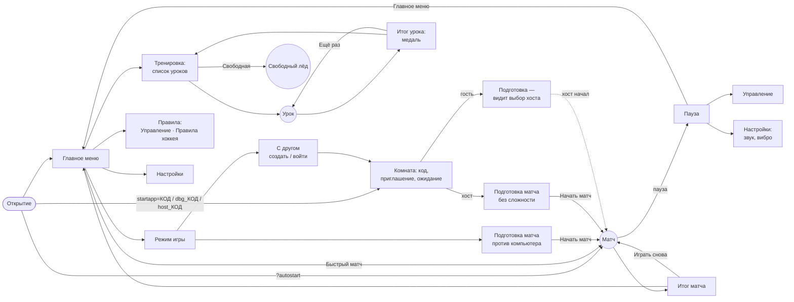

# Меню в стиле спортивных игр, музыка, тренировка — план (этап 1)

Статус (01.10.2026): этап 1 утверждён с правками (раздел 0). **Этап 2 — каркас меню, музыка и экран поворота — сделан,
ждёт проверки на телефоне.** Дальше этапы по одному.

- Макеты: `tools/menu-mock/index.html` (один файл, экран — `?s=`, язык — `&lang=`, безопасные зоны — `&st/sl/sr/sb/ct`,
  `&tg=0` — вне Telegram). Скриншоты: `node tools/menu-shots.mjs mock [--lang en|id] [--only main,prep] [--zones]`,
  «было» — `node tools/menu-shots.mjs before`. Всё складывается в `shots/menu/` (папка `shots/` не в git),
  смотреть удобно одной страницей: `shots/menu/index.html`.
- Референса `shots/ref/menu-ref.png` в репозитории нет — макеты сделаны по описанию схемы из задачи
  (список слева с полосой-градиентом, крупное название сверху слева, логотип справа, зимний фон со снегом,
  «сейчас играет» снизу слева, подсказки кнопок снизу справа).

## 0. Решения после макетов (01.10.2026)

- **Вертикального меню нет.** В вертикали на телефоне — анимация «поверни телефон» (как раньше; анимация
  телефона снова видна — раньше `paintLang()` затирала её текстом), и уже играет трек. Сценарий: открыл игру →
  «поверни телефон» + музыка → повернул → меню. На компьютере (Telegram Desktop, браузер) экрана поворота нет.
  Если автозапуск звука не разрешён (iPhone) — на экране поворота подсказка «🔊 коснись для звука», музыка
  стартует с первого касания. Телефон повернули посреди матча против ИИ — пауза.
- **«Сейчас играет»** — одна строка «BvR — Название трека»; исполнитель у всех BvR, название — имя файла из
  `assets/src/music/` (все 4 трека), альбома нет.
- **Пауза:** Продолжить · Управление (тот же экран, что в Правилах) · Настройки (без языка и музыки) · Главное меню.
- **Язык:** небольшой переключатель RU / EN / ID сбоку на главном меню и тот же выбор в Настройках, сохраняется
  (CloudStorage + localStorage `bvr_lang`).
- **Управление меню — тремя способами на всех экранах** (главное, подэкраны, подготовка, настройки, пауза, итог):
  касание; геймпад — крестовина / левый стик, A выбрать, B назад, LB/RB вкладки, Start в паузе — продолжить;
  клавиатура — стрелки, Enter / Пробел, Esc / Backspace, Q / E вкладки. Проверяет `smoke:menu` (входит в `npm run
  smoke`): меню до старта матча только клавиатурой, отдельно геймпадом и касанием.
- Ответы: меню только в горизонтали; музыка — все 4 трека, AAC `.m4a` 96 кбит/с; урок 8 — выход вратаря (держать Y),
  **ручное управление вратарём — отдельной задачей позже**; строка «Тактика» в подготовке остаётся; длина матча
  1 / 3 / 5 мин; шрифт — Fira Sans Extra Condensed 800 italic, системный — запасной, грузится не задерживая меню;
  референс не нужен.

**Профиль и Магазин (01.10.2026, после этапа 2).** На главном: «Магазин» — пункт списка, «Профиль» — карточка
справа (аватар и имя из Telegram, победы–ничьи–поражения), над логотипом. Профиль — статистика из `match:summary`:
матчи, победы, ничьи, поражения, голы (забито : пропущено), лучшая серия побед, матчи с друзьями; хранится в
localStorage и как «кэш профиля» в CloudStorage (`profile`; берётся копия, где больше матчей). Монеты — «скоро».
Магазин — витрина (форма команд, клюшки, празднование гола, лёд арены) с пометкой «скоро»: покупки откроются вместе с
сервером монет (Worker + D1, `docs/EVENTS.md`: `/v1/profile`, `/v1/purchase`) — это отдельная задача; ненастоящих
кнопок «купить» нет. Когда сервер монет появится, профиль будет брать цифры из `/v1/profile`.

## 1. Экраны и переходы

- **Назад.** В Telegram — системная `Telegram.WebApp.BackButton`: видна, когда открыт любой подэкран (глубина стека
  больше нуля), скрыта в главном меню. В матче «Назад» = пауза. Вне Telegram — своя кнопка «‹» слева от заголовка
  (макет `mock-mode-notg-*`). С клавиатуры — Esc/Backspace, с геймпада — B.
- **Стек экранов.** Каждый подэкран кладётся в стек; «Назад» снимает верхний. Вход по приглашению открывает сразу
  «С другом → Комната» (стек: главное → режим → с другом), так что «Назад» ведёт в меню, а не закрывает игру.
- **Итог матча** (`#overscr`) переделывается в том же стиле на этапе 2: «Играть снова» / «Главное меню» (гость
  онлайн-матча — только «Главное меню», как сейчас).

## 2. Вид (общий для всех экранов)

- Слева — вертикальный список крупным жирным курсивом. Выбранный пункт: полоса с градиентом (золотой край →
  синий → фиолетовый, затухает вправо), стрелка «›», под пунктом — строка пояснения (у «Быстрого матча» —
  последние команды, сложность и длина).
- Сверху слева — «BVR HOCKEY **26**» (на подэкранах маленьким, над названием экрана). Справа — логотип
  (`assets/src/logo.png`, игра его уже грузит для текстуры льда — лишних байтов нет) или карточка выбранного пункта.
- Фон — ночная арена: свет прожекторов, лёд в перспективе с линиями, сугробы и изморозь по краям, падающий снег
  (70 точек на CSS-анимации; на «низком» — 25 и без размытия). В паузе и в уроке фон — сам матч под затемнением.
- Снизу слева — «Сейчас играет» (эквалайзер, трек, исполнитель · альбом), снизу справа — подсказки кнопок.
  Подсказки зависят от того, чем играют: геймпад — цветные A/B/LB/RB, клавиатура — клавиши Enter/Esc/Q/E,
  касание — прячутся (кроме «‹ ›» у значений).
- Шрифт заголовков и пунктов — Fira Sans Extra Condensed 800 italic (OFL, латиница + кириллица, для ID/EN
  качается только латиница). Мелкий текст — системный шрифт.
- Цвета — из игры: золотой `#ffd166` (как сейчас), голубой `#8fd8ff`, градиент логотипа (фиолетовый → синий),
  цвета кнопок A/B/X/Y — как на экранном пульте.
- Безопасные зоны: всё содержимое ниже `safeAreaInset.top + contentSafeAreaInset.top` (кнопки Telegram «Закрыть»
  и «⌄ •••»), по бокам — `safeAreaInset.left/right`, снизу — `safeAreaInset.bottom`; расчёт тот же, что для табло
  (`safeInsets()`, `tgButtonsBand()`). Проверка — в `smoke:tg` (см. раздел 7).

## 3. Управление меню

| | Телефон | Клавиатура | Геймпад |
|---|---|---|---|
| двигаться по пунктам | касание пункта (сразу открывает) | ↑ ↓ | крестовина / левый стик ↑ ↓ |
| выбрать | касание | Enter, Пробел | A |
| изменить значение | касание «‹ ›», ползунки — перетаскиванием | ← → | крестовина ← → |
| назад | BackButton Telegram / «‹» | Esc, Backspace | B |
| вкладки (Правила) | касание вкладки | Q / E | LB / RB |
| пауза в матче | кнопка паузы | Esc | Start |

- Фокус есть всегда (полоса/обводка), так что с геймпада и клавиатуры меню проходится без мыши.
- Вибрация (если включена в Настройках): `HapticFeedback.selectionChanged()` при смене пункта касанием,
  `impactOccurred('light')` при выборе. Звук: тихий щелчок перемещения и выбора (громкость «Звуки»).

## 4. Экраны

| Экран | Содержимое | Макет |
|---|---|---|
| Главное меню | Быстрый матч · Режим игры · Тренировка · Правила · Настройки; справа логотип | `mock-main-*` |
| Быстрый матч | в одно касание — матч против ИИ с последними выбранными командами / сложностью / длиной / тактикой (первый раз — Красные — Зелёные, нормальная, 3 мин) | — |
| Режим игры | Против компьютера · С другом; справа — карточки «команда VS CPU» | `mock-mode-*` |
| Подготовка матча (ИИ) | две карточки команд с майками в цветах клуба (‹ › — сменить клуб, соперник не может совпасть), сложность, длина матча, тактика, «Начать матч» | `mock-prep-*` |
| С другом | Создать комнату · Войти по коду; справа — код комнаты, «Ждём друга…», «Отправить приглашение» (как сейчас: ссылка `t.me/…?startapp=КОД`) | `mock-friend-*` |
| Подготовка (с другом) | у хоста — то же без сложности, строка «Друг в комнате»; гость видит выбор хоста (только чтение) и ждёт старта | `mock-prepfriend-*` |
| Тренировка | список 10 уроков с медалями и галочками + «Свободная тренировка»; справа — задача, условие, пороги медалей, лучший результат, «Начать урок»; сверху — «Медали 7 / 30» | `mock-train-*` |
| Урок | поверх матча: задача сверху, счётчик и время слева, пороги медалей справа, подсказка кнопки снизу, мишени | `mock-lesson-land` |
| Итог урока | «✓ Выполнено», медаль, 3 цифры (попадания / точность / время), порог следующей медали, «Ещё раз» / «Дальше» | `mock-lessondone-*` |
| Правила → Управление | вкладка устройства (Экран / Клавиатура / Геймпад; открыта та, чем играют), схема раскладки, таблица «с шайбой / в обороне» | `mock-controls-*` |
| Правила → Правила хоккея | Офсайд · Проброс · Удаления · Вбрасывание · Длина матча · Гол — список и карточка со схемой; тексты сверены с `shared/sim.js` (отложенный офсайд, проброс из своей половины, 2 мин за силовой против игрока без шайбы) | `mock-rules-*` |
| Настройки | Язык ‹ › · Графика ‹Авто/Низк./Сред./Выс.› · Показ FPS · Музыка (ползунок) · Звуки (ползунок) · Вибрация; справа — пояснение к выбранной строке | `mock-settings-*` |
| Пауза | Продолжить · Управление · Настройки (звук/вибро) · Главное меню; справа — счёт и время | `mock-pause-*` |

**Вертикаль** — см. раздел 0: меню только в горизонтали, в вертикали — экран поворота с музыкой.

**Хранение.** Через уже готовые `prefGet/prefSet` (CloudStorage, запасной localStorage), JSON, лимит CloudStorage
4 КБ на значение с запасом:
- `bvr_set` — `{lang, q, fps, mus, sfx, vib}` (язык и графика переезжают сюда из `bvr_lang`/нынешних ключей, старые
  читаются один раз при первом запуске);
- `bvr_last` — последний матч против ИИ `{my, opp, diff, min, tac}` для «Быстрого матча»;
- `bvr_train` — `{v:1, l:{1:{m:'g', best:…}, …}}` — медали и лучшие результаты уроков.

**Совместимость (тесты и ссылки).** Корневой элемент меню остаётся `#start` (его ждёт `tools/load.mjs`),
`__hk.start()` по-прежнему начинает матч с текущими настройками подготовки (так стартуют `smoke:online`,
`smoke:server`, `smoke:lag`, `perf`). `?autostart`, `?debug`, `startapp=КОД / dbg_ / host_` работают как сейчас.
`smoke-quality` щёлкает `#qT .chip` — переведу его на `__hk.q()`/новый экран настроек. Новый помощник для тестов:
`__hk.menu('prep')` — открыть экран, `__hk.menuState()` — текущий экран и фокус.

## 5. Тренировка — 10 уроков

Уроки идут офлайн, на той же симуляции (`shared/sim.js`), каждый — отдельный сценарий: расстановка, кто на льду,
условие «выполнено» и счётчик. Камера урока ставит нужное место (ворота, партнёров) так, чтобы его не закрывали
экранные кнопки справа (на кадре `mock-lesson-land` ворота частично под RT — в уроке так быть не должно).
Пороги медалей — стартовые, подгоню на этапе 5 по прогону автопилотом (золото должно быть трудным, бронза — у всех
с первого-второго раза).

| # | Урок | Кнопки | Задача (на экране) | Выполнено | Бронза / Серебро / Золото |
|---|---|---|---|---|---|
| 1 | Катание и ускорение | стик, RT | проедь слаломом 6 ворот-флажков до финиша | все 6 ворот | ≤ 30 с / ≤ 22 с / ≤ 16 с |
| 2 | Пас | A | отдай 5 пасов партнёрам в кругах | 5 точных пасов | 5 пасов / ≤ 1 промах и ≤ 25 с / без промахов и ≤ 18 с |
| 3 | Пас в разрез | Y | партнёр уходит в отрыв — отдай пас на ход 4 раза | 4 паса приняты на ходу | 4 из 8 / 4 из 6 / 4 из 4 |
| 4 | Навес | X | перебрось шайбу через клюшку защитника к партнёру | 3 паса над клюшкой | 3 из 8 / 3 из 5 / 3 из 3 |
| 5 | Бросок с зарядом | B | держи — заряд, отпусти — бросок; мишени в 4 углах ворот, без вратаря, 8 шайб | 3 попадания | 3 / 5 / 7 из 8 |
| 6 | Отбор и силовой | B, X | соперник ведёт шайбу по кругу — отбери клюшкой или силовым | 3 отбора | 3 отбора / ≤ 40 с / ≤ 25 с |
| 7 | Смена игрока | A, LB | шайба катится к одному из трёх партнёров — переключись и подбери | 5 подборов | 5 / в среднем ≤ 1,2 с / ≤ 0,8 с |
| 8 | Игра вратарём | Y | 8 выходов один на один; держи Y — вратарь выходит на носителя | 4 сейва | 4 / 6 / 7 сейвов |
| 9 | Тактика | крестовина / 1 2 3 | на льду меняется ситуация (соперник давит / ты ведёшь в счёте / равная игра) — включи нужную тактику | 3 смены вовремя | 3 из 3 / каждая ≤ 3 с / ≤ 1,5 с |
| 10 | Итог: атака 2 на 1 | все | ты и партнёр против защитника и вратаря, 5 атак | 1 гол | 1 / 2 / 3 гола |

- **Свободная тренировка:** лёд без соперников (переключатель «пассивные соперники» — стоят и не отбирают),
  шайба возвращается кнопкой; можно пробовать всё, без счёта.
- **Урок 8 — вопрос.** Ручного управления вратарём в игре сейчас нет (флаг `goalieCtl` есть, но нигде не
  включается): есть только «держи Y — вратарь выходит на носителя». План — урок на выход вратаря (как в таблице).
  Если нужна полноценная «игра вратарём» (вести вратаря стиком) — это новая механика в `shared/sim.js`
  с проверкой баланса, её лучше делать отдельной задачей.
- **Проверка:** `smoke:train` — каждый урок проходится скриптом ввода (как `__hk.move/press` в тестах) до
  «выполнено», медаль и прогресс пишутся, после перезапуска видны; без сети (запросы к серверу — ошибка теста).

## 6. Музыка (сделана в этапе 2)

Сделано: 4 трека → `assets/dist/music-<хеш>.m4a` (AAC 96 кбит/с, `afconvert`; хеш — от исходника и настроек,
`npm run check` не перекодирует), 1,4–2,6 МБ, всего 7,6 МБ; вперемешку без повтора подряд; первый трек качается
после моделей игроков (на 3G иначе матч стартовал на 1,8 с позже); затухание 0,8 с при старте матча и появление
в меню; громкость «Музыка» через WebAudio (на iPhone `<audio>.volume` не работает); `?nomusic` — без музыки
(для тестов раскладки). Ниже — исходный план.

- В `assets/src/music/` сейчас 4 трека с настоящими названиями, а не `menu1–3.mp3`: «Ice cold» (2:47),
  «Sang & Glace» (1:56), «Still Here» (3:42), «Коробка» (2:24), все ~180 кбит/с, 4–6,4 МБ. Предлагаю взять все четыре,
  метаданные — в `assets/src/music/tracks.json` (исполнитель / альбом пока заглушки).
- Пережатие: `ffmpeg` на машине нет, в macOS есть `afconvert` → AAC-LC `.m4a` 96 кбит/с (играет и на iPhone, и на
  Android; по качеству ≈ MP3 128). Встраиваю в `tools/pack-assets.mjs` (хеш в имени, кеш навсегда). Размеры:
  1,4 / 1,9 / 2,7 / 1,7 МБ (всего ~7,8 МБ; при MP3 128 кбит/с было бы ~10,4 МБ).
- Загрузка: после показа меню и первого касания (iPhone без касания звук не запустит), по одному треку;
  следующий качается, когда текущий доигрывает. Порядок — вперемешку без повторов подряд.
- Громкость «Музыка» из Настроек; при старте матча/урока — затухание за ~0,8 с, при возврате в меню — появление.
  Плашка «Сейчас играет» меняется с плавным переходом.

## 7. Проверки по этапам

- Каждый этап — отдельный коммит; push — только если по кодам возврата прошли `check`, `smoke`, `smoke:online`,
  `smoke:tg`, `smoke:lag`, `smoke:server`.
- `smoke:tg` расширяется на меню: каждый экран в горизонтали и вертикали, RU/EN/ID — ничего не лежит в зонах кнопок
  Telegram и вне безопасной зоны, тексты влезают в свои пункты/кнопки, `BackButton.show/hide` вызываются правильно.
- Новый `smoke:menu`: проход по всем экранам клавиатурой, эмуляцией геймпада и касанием, «Назад» с каждого экрана,
  «Быстрый матч» стартует с сохранёнными настройками, настройки переживают перезагрузку.
- `tools/load.mjs`: время до меню не должно вырасти заметнее оценки ниже.
- Скриншоты «до/после» — `node tools/menu-shots.mjs …` в `shots/menu/`.

## 8. Вес и загрузка

Сейчас `index.html` — 293 КБ, в сжатом виде 102 КБ gzip / 83 КБ brotli; `shared/sim.js` — 20 КБ brotli.

| Что | Сколько | Когда грузится | Влияние на открытие |
|---|---|---|---|
| Разметка, CSS, логика и тексты меню (RU/EN/ID) | +45–60 КБ, ≈ +13–17 КБ brotli (макет со всеми экранами и текстами — 53 КБ / 15 КБ) | в `index.html` | ≈ +18 % к сжатому HTML: ~+15 мс на 4G, ~+70 мс на медленном 3G; разбор — единицы мс |
| Шрифт (1 начертание) | 26 КБ латиница + 13 КБ кириллица (woff2); RU качает оба, EN/ID — только латиницу | после первой отрисовки, `font-display: swap`, `assets/dist` с хешем (кеш навсегда) | не задерживает: сначала системный шрифт, потом подменяется; можно урезать до ~15–20 КБ, оставив только нужные буквы |
| Логотип | 0 (уже грузится для льда) | — | — |
| Зимний фон, снег | 0 байт картинок (CSS) | — | — |
| Музыка (этап 3) | 1,4–2,7 МБ на трек (AAC 96 кбит/с) | после показа меню, по одному треку | не задерживает меню; расход мобильного трафика ~2 МБ за первый трек |
| Тренировка (этап 5) | +20–30 КБ кода | отдельным файлом `shared/drills.js` при входе в «Тренировку» | 0 при открытии |
| 3D-фон меню (этап 6) | 0 новых файлов (наш движок и уже загруженные модели) | после показа меню, только «среднее»/«высокое» | на открытие — 0; нагрузка на GPU в меню |

**Факт после этапа 2** (`node tools/load.mjs`, CPU ×4): сжатый `index.html` 88 → 106 КБ (+18 КБ); открытие меню,
медиана 3 прогонов на 4G — 474 → 509 мс холодный заход, 310 → 329 мс повторный; медленный 3G — 4,2 → 4,9 с
(больше HTML). Шрифт 26 КБ (латиница; кириллица 13 КБ — только для русского) грузится после показа меню.
Музыка — после моделей игроков: время до матча на 3G не изменилось (+5,0 → +5,2 с).

## 9. Этапы

1. **План и макеты** — этот документ, `tools/menu-mock/`, `tools/menu-shots.mjs`. Готово, утверждено с правками.
2. **Каркас меню + музыка + экран поворота** — готово, ждёт проверки на телефоне. Стек экранов и навигация
   (касание / клавиатура / геймпад, BackButton Telegram, своя «‹» вне Telegram), главное меню с языком, Быстрый
   матч (последние команды / длина / тактика, `bvr_last`), Режим игры, подготовка матча (ИИ; с другом — хост
   выбирает, гость видит выбор через сообщение `prep`), комната (создать / войти по коду / пригласить), Настройки
   (язык, графика, FPS, музыка, звуки, вибрация — CloudStorage + localStorage), Правила (Управление: экран /
   клавиатура / геймпад; Правила хоккея), новая пауза и итог матча; зимний фон на CSS, снег (на «низком» — без);
   под непрозрачным меню площадка не рисуется. Проверки: `smoke:menu`, меню в `smoke:tg`, скриншоты
   `node tools/menu-shots.mjs after` → `shots/menu/after-*.png`.
3. **Музыка** — сделана в этапе 2 (раздел 6).
4. **Правила и управление:** экран уже есть (этап 2); осталось — выверить схемы с реальной раскладкой, подсветку
   кнопок по устройству, «Правила хоккея» — схемы-картинки поподробнее.
5. **Тренировка:** 10 уроков, медали, прогресс в CloudStorage, свободная тренировка, `smoke:train`.
6. **Первый запуск и полировка:** предложение «Пройди тренировку за 2 минуты», экран загрузки матча с советом,
   статистика игрока в главном меню (локально из `match:summary`), 3D-облёт пустой арены на «среднем»/«высоком».

## 10. Вопросы этапа 1 (решены — раздел 0)

1. **Вертикаль:** меню в обеих ориентациях, матч и уроки — только в горизонтали (с авто-паузой при повороте)?
2. **Музыка:** брать 4 трека из папки (не 3 `menu1–3.mp3`)? Формат AAC `.m4a` 96 кбит/с вместо MP3 — подходит?
3. **Урок 8:** выход вратаря (есть в игре) или новая механика ручного управления вратарём отдельной задачей?
4. **Подготовка матча:** добавил строку «Тактика» (в задаче не было, в игре есть) — оставить? Длина матча — 1 и 3 мин,
   как сейчас, или добавить 5 мин?
5. **Шрифт:** Fira Sans Extra Condensed 800 italic (~39 КБ, OFL) — ок? Альтернатива — только системный жирный шрифт
   (0 КБ, но без «спортивного» вида).
6. **Референс** `shots/ref/menu-ref.png` не найден — если он важен, пришлите: сверю макеты с ним до этапа 2.
